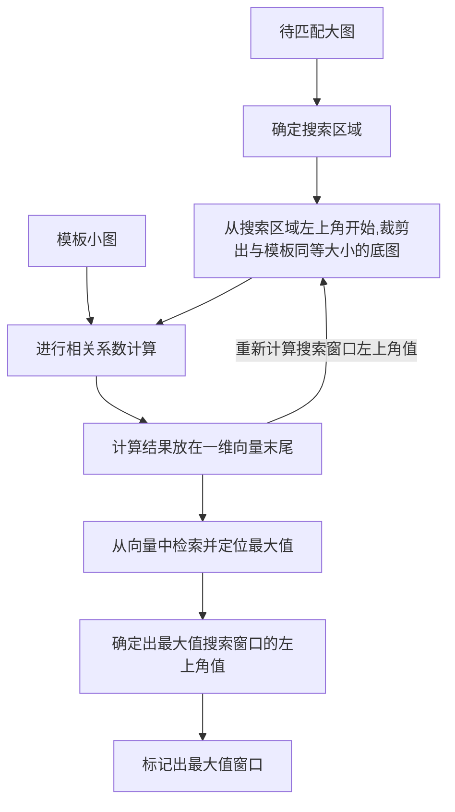

### 基于OpenCV的相关系数法影像匹配

#### 处理流程

```mermaid
graph TB
a[待匹配大图]
b[模板小图]
a-->c
c[确定搜索区域]
c-->d
d[从搜索区域左上角开始,裁剪出与模板同等大小的底图]
e[进行相关系数计算]
d-->e
b-->e
e-->f
f[计算结果放在一维向量末尾]
f--重新计算搜索窗口左上角值-->d
g[从向量中检索并定位最大值]
f-->g
h[确定出最大值搜索窗口的左上角值]
i[标记出最大值窗口]
g-->h
h-->i

```

#### 依赖项

- [x] Opencv >=3.0
- [x] C++